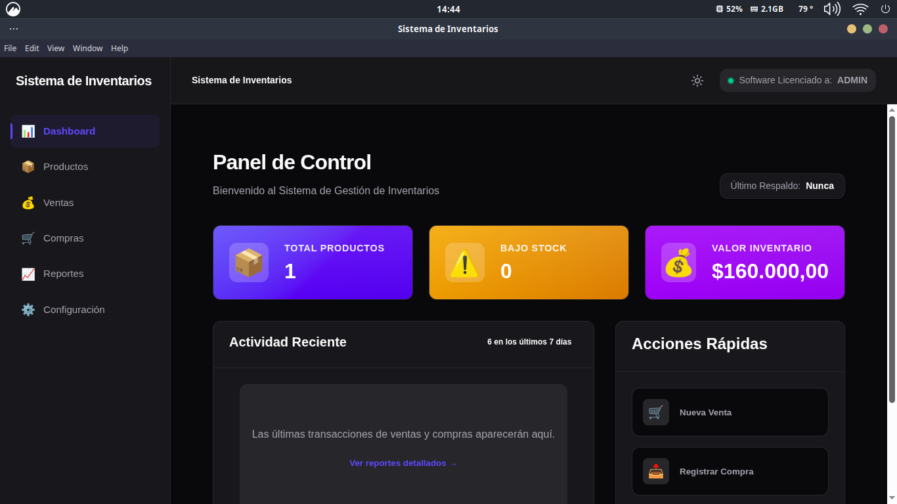
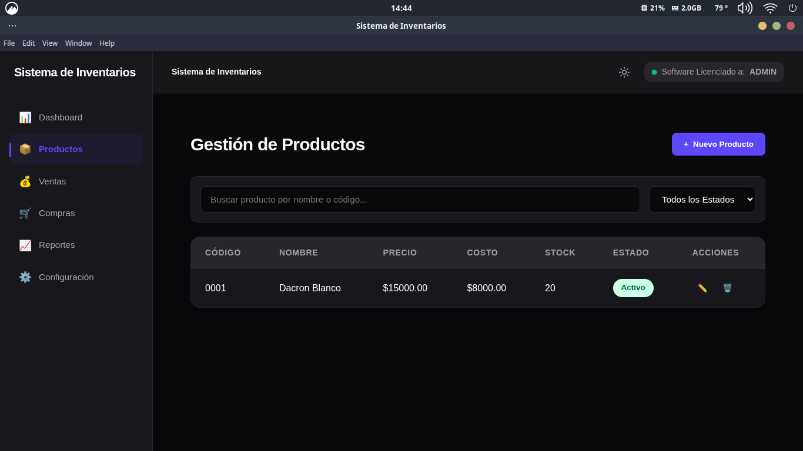
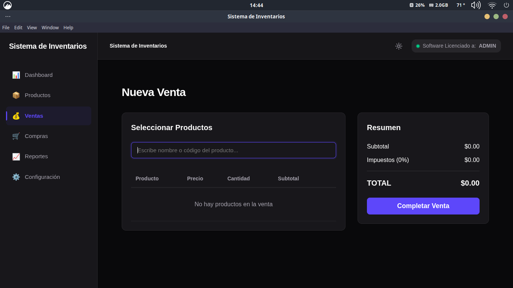
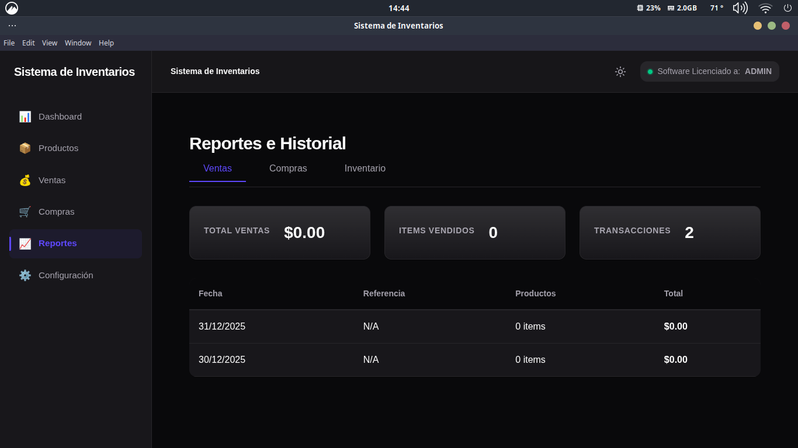

# Sistema de Gestión de Inventarios (SGI) - V0.1

Sistema profesional de gestión de inventarios **offline-first** con seguridad vinculada al hardware (licenciamiento), diseñado para ser escalable, robusto y fácil de usar.

---

## 📸 Capturas de Pantalla

| Dashboard | Productos |
|:---:|:---:|
|  |  |

| Ventas | Reportes |
|:---:|:---:|
|  |  |


## 🚀 Características Principales

- 🔓 **Acceso por Licencia**: Seguridad vinculada al Hardware ID. Incluye **importación de licencias desde la UI** para facilitar la activación.
- 📦 **Gestión de Stock**: Control total de productos. Incluye **eliminación definitiva** (hard delete) para depuración y filtros por estado.
- 📊 **Dashboard & Reportes**: KPIs visuales, alertas de bajo stock y valorización automática del inventario.
- ☁️ **Sincronización Cloud**: Respaldos cifrados en Google Drive con autenticación OAuth integrada y segura.
- 🛡️ **Confirmaciones Seguras**: Sistema de diálogos modales no bloqueantes para operaciones críticas, garantizando una experiencia fluida.
- 🎨 **Branding Personalizable**: Ajusta el nombre del sistema y los colores corporativos desde la interfaz.

---

## 🏗️ Arquitectura y Escalabilidad

El proyecto utiliza una arquitectura **Clean/Modular** que separa claramente la lógica de negocio de la implementación técnica, lo que facilita enormemente su escalabilidad.

### Estructura de Capas

```
SGI_0.1V/
├── backend/                   # Lógica Central (Node.js)
│   ├── api/                   # Handlers IPC Modularizados (Product, Movement, License, etc.)
│   ├── domain/                # Capa de Negocio (Entidades, Repositorios e Interfaces)
│   └── infrastructure/        # Implementaciones Técnicas (Prisma DB, Sync, Crypto)
├── electron/                  # Proceso Principal y Seguridad
│   └── license/               # Sistema de validación de hardware y cifrado de licencias
├── frontend/                  # Interfaz de Usuario (React + Vite)
│   ├── src/
│   │   ├── components/       # UI Reutilizable y Guardias de Seguridad
│   │   ├── services/         # Cliente API (Puente IPC seguro y tipado)
│   │   └── contexts/         # Gestión de Estado Global (Licencia, Tema)
├── shared/                    # Tipos TypeScript compartidos (Frontend <-> Backend)
└── prisma/                    # Esquema de Base de Datos (SQLite)
```

### Cómo Escalar el SistemaGrant principals access to this resource and add roles to specify what actions the principals can take. Optionally, add con
Para añadir un nuevo módulo (ej: "Proveedores"):
1. **Dominio**: Crea la entidad en `backend/domain/entities` y su interfaz en `repositories`.
2. **Infraestructura**: Implementa el repositorio en `backend/infrastructure/database/repositories`.
3. **API**: Crea un nuevo handler modular en `backend/api/proveedorHandlers.ts` y regístralo en `backend/api/index.ts`.
4. **Frontend**: Añade el servicio en `frontend/src/services/api.ts` y crea la página correspondiente.

---

## 🛠️ Guía de Inicio Rápido

### Requisitos
- **Node.js**: >= 18.x
- **Dependencias**: `npm install`
- **Base de Datos**: `npm run prisma:generate && npm run prisma:migrate`

### Ejecución en Desarrollo
```bash
# Iniciar Frontend + Electron
npm run dev
```

### Gestión de Licencias (Activación)
El sistema requiere una licencia vinculada a tu máquina. Para activarlo localmente durante el desarrollo:
```bash
# Generar licencia para tu equipo actual automáticamente
npm run license:gen
```

---

## 🔐 Seguridad y Datos

- **Licenciamiento**: El `MachineIdGenerator` crea una huella digital única basada en el hardware. Solo los archivos `.lic` firmados con la clave maestra pueden desbloquear el acceso.
- **Cifrado**: Los respaldos se protegen con **AES-256-GCM** antes de salir del equipo.
- **Base de Datos**: Utiliza SQLite para una portabilidad total sin dependencias de servidores externos.

---

## 🛠️ Comandos Útiles

| Comando | Descripción |
| :--- | :--- |
| `npm run dev` | Inicia el entorno de desarrollo completo. |
| `npm run license:gen` | Genera y aplica una licencia local válida en la raíz del proyecto. |
| `npm run build` | Prepara el proyecto para distribución. |
| `npm run package` | Empaqueta la aplicación para el sistema operativo actual. |

---

**Desarrollado por:** Breyner Ciro
**Celular:** 3183420438
**Email:** breynerismael@gmail.com
**Tecnologías:** Electron, React, TypeScript y Prisma.
